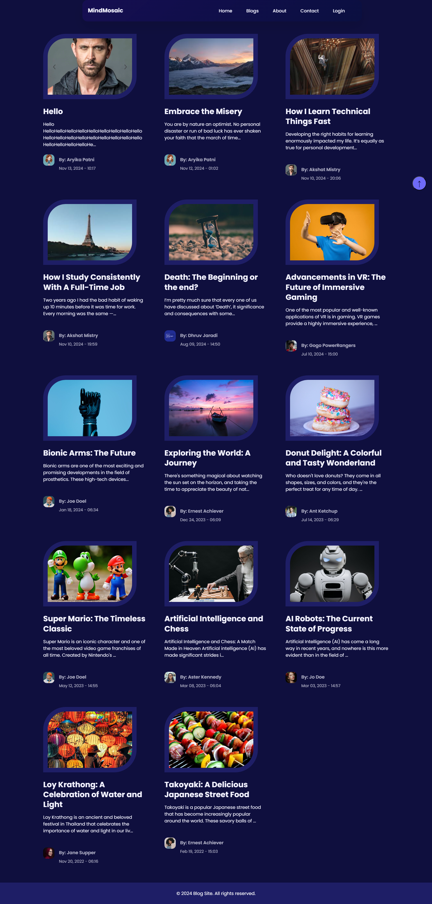
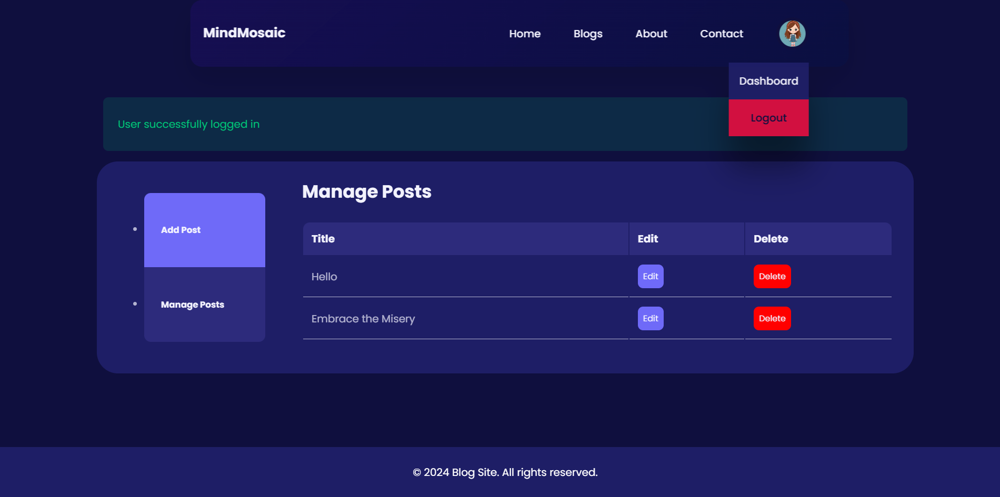
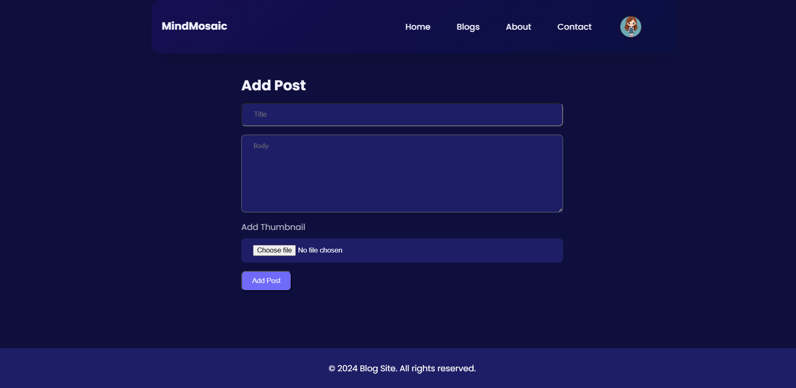
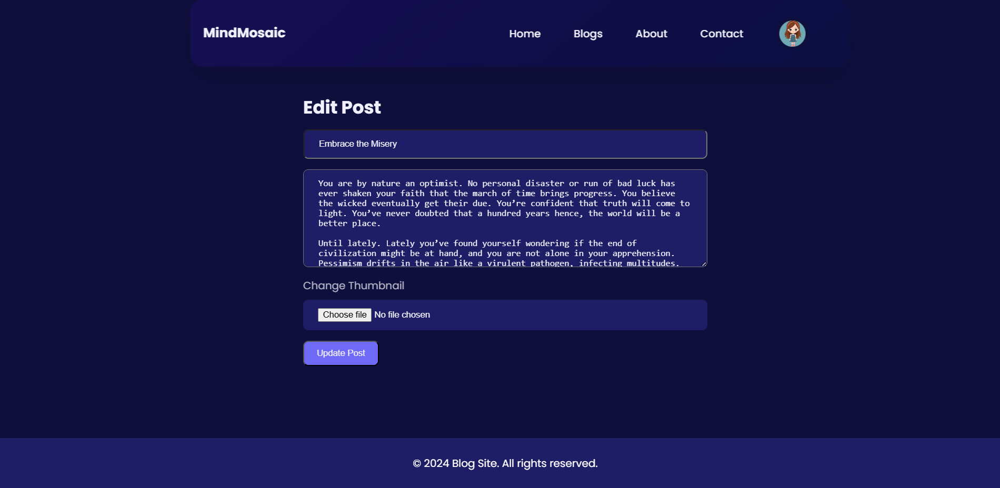

# 🧩 MindMosaic - A Blog Website

MindMosaic is a dynamic blog platform built with **HTML, CSS, JavaScript, PHP, and MySQL**. It enables users to create, manage, and explore blog posts with ease. Designed for seamless blogging, it runs locally using **XAMPP**.

---

## 🚀 Features
✔️ User authentication (Login/Signup)  
✔️ Create, edit, and delete blog posts   
✔️ Responsive and modern UI  
✔️ Database-driven content management  

---

## 🛠️ Tech Stack
**Frontend:** HTML, CSS, JavaScript  
**Backend:** PHP  
**Database:** MySQL  
**Server:** XAMPP (Apache & MySQL)  

---

## 📌 Installation & Setup
### 🔹 1. Clone the Repository
```sh
git clone https://github.com/akshatkmistry/MindMosaic.git
cd MindMosaic
```

### 🔹 2. Setup Database
1. Open **phpMyAdmin** in your browser (`http://localhost/phpmyadmin/`)
2. Create a new database named `mindmosaic`
3. Import the `blog.sql` file (provided in the repo)

### 🔹 3. Configure Database Connection
1. Open `constants.php` in `config` folder.
2. Update the database credentials if needed:
```php
$servername = "localhost";
$username = "root";
$password = "";
$database = "mindmosaic";
```

### 🔹 4. Run the Project
1. Start **XAMPP** and enable `Apache` & `MySQL`
2. Open your browser and visit:  
   **`http://localhost/MindMosaic`**

---

## 🖼️ Screenshots
### 🔹 Homepage


### 🔹 Blog Post Page


### 🔹 Admin Home page


### 🔹 Add Blog Page


### 🔹 Edit Blog Page


### 🔹 Sign In Page


### 🔹 Sign Up Page


---

## 🤝 Contributing
🚀 Feel free to fork the repository and submit pull requests! Contributions are welcome.  

---

## 📜 License
This project is open-source and available under the **MIT License**.

---

## 📧 Contact
For any queries, reach out via **GitHub Issues** or email at:  
✉️ **akshatkmistry007@gmail.com **  

Happy Coding! 🎉

